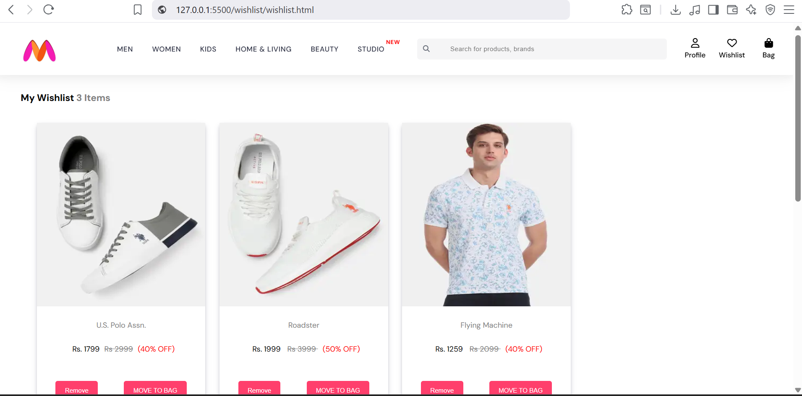
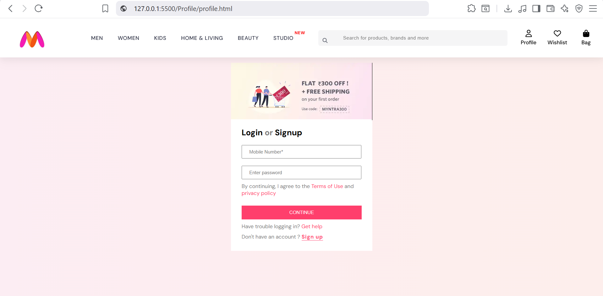
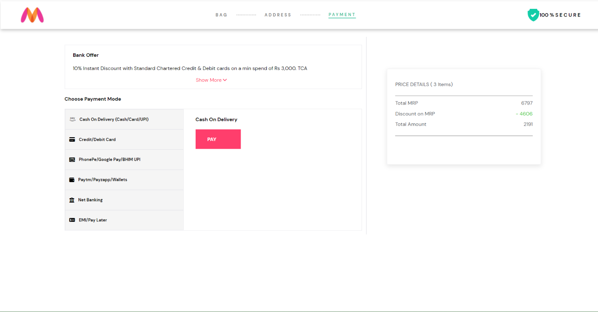
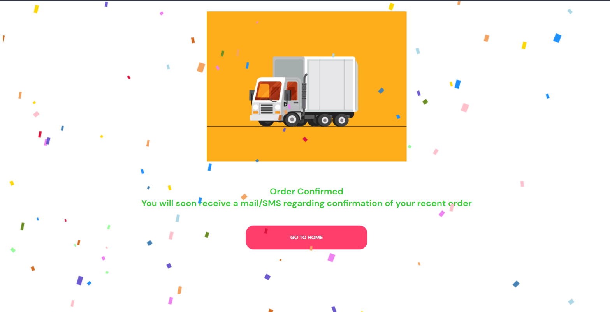

**Myntra Clone Project**

This is a clone project of Myntra, an online fashion and lifestyle store. The project is built using HTML, CSS, JS, and Node.js.
Myntra is a major Indian fashion e-commerce company headquartered in Bengaluru, Karnataka, India. The company was founded in 2007 to sell personalized gift items. In May 2014, Myntra.com was acquired by Flipkart.

**Installation**

To run the Myntra clone project, follow these steps:

1-> Clone the repository.
2-> Install the dependencies.
3-> Start the server.

🖥️ Project Screenshots

🏠 Homepage
The homepage contains a navigation bar that allows users to browse different sections like Men, Women, and Home Living.

👔 Men's Section
Outer Men's Page
Displays different brands and categories of men's clothing and accessories.

Inner Men's Page
After clicking a brand, the user is redirected to the product listing page where they can:

Add items to Wishlist
Add items to Bag
Apply filters
Sort products by price or brand

👗 Women's Section
Outer Women's Page
Displays brands and categories for women's fashion products.

Inner Women's Page
Users can browse products and:

Add to wishlist
Add to bag
Filter by brand or price
Sort products

🏠 Home & Living Section
This section displays products related to home decor and living essentials.
Users can browse products and add them to their bag or wishlist.

❤️ Wishlist Page
The Wishlist page shows all the products saved by the user.
Users can move items from wishlist to bag.

🔐 Login or SignUp Page.
Users can login or sign up using their credentials.
Authentication checks if the email and password match existing data.

💳 Payment Page
After placing an order, users are redirected to the payment page.

Payment methods include:
Cash on Delivery
Debit Card
Credit Card

📦 Order Confirmation Page
Once the payment method is selected and the order is placed successfully, the user is redirected to the Order Confirmation Page.

